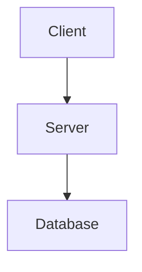

# Documentation Standards

**Version:** 1.0
**Last Updated:** 2025-10-18

---

## 1. Purpose

This document defines the documentation structure, naming conventions, and standards for the Discord Bot project.

---

## 2. Documentation Structure

```
docs/
├── README.md                           # Documentation index & overview
│
├── 01-planning/                        # Planning & requirements
│   ├── 01-product-requirements.md     # PRD - What we're building
│   ├── 02-functional-specs.md         # Functional specifications
│   └── 03-user-stories.md            # Detailed user stories (future)
│
├── 02-architecture/                    # Architecture & design
│   ├── 01-technical-overview.md       # High-level architecture
│   ├── 02-database-design.md          # Database schema & ERD
│   ├── 03-command-system.md           # Command architecture
│   └── 04-api-design.md              # API design (future)
│
├── 03-guides/                          # How-to guides
│   ├── 01-getting-started.md         # Setup & first run
│   ├── 02-development-setup.md       # Dev environment setup
│   ├── 03-database-setup.md          # Database configuration
│   ├── 04-adding-commands.md         # How to add new commands
│   └── 05-deployment.md              # Deployment guide (future)
│
├── 04-reference/                       # Reference documentation
│   ├── 01-configuration.md           # Configuration options
│   ├── 02-api-reference.md           # API reference (future)
│   └── 03-troubleshooting.md         # Common issues & solutions (future)
│
└── 05-adr/                            # Architecture Decision Records
    ├── README.md                      # ADR index
    ├── 001-use-blazor-server.md      # Example ADR
    ├── 002-use-sqlite-for-dev.md     # Example ADR
    └── template.md                    # ADR template
```

---

## 3. Naming Conventions

### File Naming

**Pattern**: `[number]-[kebab-case-description].md`

**Rules**:
- Use **lowercase** with **hyphens** (kebab-case)
- Prefix with **two-digit number** for ordering (01, 02, 03...)
- Use **descriptive names** that indicate content
- Use `.md` extension for all markdown files

**Examples**:
- ✅ `01-product-requirements.md`
- ✅ `02-database-design.md`
- ✅ `03-adding-commands.md`
- ❌ `PRD.md` (no prefix, not descriptive)
- ❌ `Technical_Specs.md` (underscores, capitalized)
- ❌ `database.md` (no prefix, too vague)

### Directory Naming

**Pattern**: `[number]-[category-name]/`

**Rules**:
- Use **lowercase** with **hyphens**
- Prefix with **two-digit number** for ordering
- Use **category names** that group related docs

**Examples**:
- ✅ `01-planning/`
- ✅ `02-architecture/`
- ✅ `03-guides/`
- ❌ `Planning/` (capitalized, no prefix)
- ❌ `how_to/` (underscores)

---

## 4. Document Structure

### Standard Header

Every document should start with:

```markdown
# Document Title

**Version:** [X.Y]
**Last Updated:** [YYYY-MM-DD]
**Status:** [Draft | Active | Deprecated]

---

## Overview

Brief description of what this document covers.

---

## Table of Contents (optional for long docs)

- [Section 1](#section-1)
- [Section 2](#section-2)
...
```

### Section Hierarchy

```markdown
# Document Title (H1 - only once, at top)

## Major Section (H2)

### Subsection (H3)

#### Detail Section (H4)

##### Fine Detail (H5 - rarely used)
```

**Rules**:
- Only **one H1** per document (the title)
- Use **H2** for major sections
- Use **H3** for subsections
- Avoid going deeper than H4 unless absolutely necessary

---

## 5. Document Types & Templates

### 5.1 Product Requirements Document (PRD)

**Location**: `01-planning/01-product-requirements.md`

**Sections**:
1. Overview
2. Goals & Objectives
3. Target Users
4. Core Features
5. Non-Functional Requirements
6. Out of Scope
7. Success Metrics
8. Future Considerations

---

### 5.2 Functional Specifications

**Location**: `01-planning/02-functional-specs.md`

**Sections**:
1. User Stories
2. User Flows
3. Functional Requirements
4. Non-Functional Requirements
5. Validation Rules
6. Error Scenarios
7. UI/UX Specifications
8. Audit & Logging

---

### 5.3 Technical Overview

**Location**: `02-architecture/01-technical-overview.md`

**Sections**:
1. Technology Stack
2. Project Structure
3. Architecture Layers
4. Key Components
5. Configuration
6. Dependency Injection
7. Security Considerations
8. Performance Considerations

---

### 5.4 Database Design

**Location**: `02-architecture/02-database-design.md`

**Sections**:
1. Database Strategy (providers)
2. Entity Relationship Diagram
3. Entity Definitions
4. Relationships & Constraints
5. Indexes
6. Migration Strategy
7. Common Queries
8. Cross-Database Compatibility

---

### 5.5 Architecture Decision Record (ADR)

**Location**: `05-adr/[number]-[decision-name].md`

**Template**:
```markdown
# [Number]. [Decision Title]

**Date:** [YYYY-MM-DD]
**Status:** [Proposed | Accepted | Deprecated | Superseded]
**Deciders:** [Names/Roles]

---

## Context

What is the issue we're seeing that is motivating this decision?

## Decision

What is the change we're proposing/decided on?

## Consequences

What becomes easier or harder to do because of this change?

### Positive
- [Benefit 1]
- [Benefit 2]

### Negative
- [Drawback 1]
- [Drawback 2]

### Neutral
- [Neutral impact 1]

## Alternatives Considered

What other options did we consider?

1. **Alternative 1**
   - Pros: ...
   - Cons: ...

2. **Alternative 2**
   - Pros: ...
   - Cons: ...

## References

- [Link to related issue]
- [Link to discussion]
```

---

### 5.6 How-To Guide

**Location**: `03-guides/[number]-[guide-name].md`

**Template**:
```markdown
# How to [Task]

**Difficulty:** [Beginner | Intermediate | Advanced]
**Time Required:** [X minutes]

---

## Prerequisites

- Requirement 1
- Requirement 2

## Steps

### Step 1: [Action]

Description and code examples.

### Step 2: [Action]

Description and code examples.

## Verification

How to verify the task was completed successfully.

## Troubleshooting

Common issues and solutions.

## Next Steps

What to do after completing this guide.
```

---

## 6. Code Block Standards

### Language Specification

Always specify the language for syntax highlighting:

````markdown
```csharp
public class Example { }
```

```json
{
  "key": "value"
}
```

```bash
dotnet build
```
````

### File Path Comments

Include file paths in code blocks:

````markdown
```csharp
// Program.cs
var builder = WebApplication.CreateBuilder(args);
```

```json
// appsettings.json
{
  "Database": {
    "Provider": "sqlite"
  }
}
```
````

---

## 7. Linking Standards

### Internal Links (within docs/)

Use **relative paths**:

```markdown
See [Database Design](../02-architecture/02-database-design.md) for details.
See the [ADR on SQLite](../05-adr/002-use-sqlite-for-dev.md).
```

### External Links

Use **full URLs** with descriptive text:

```markdown
See the [Discord.Net documentation](https://docs.discordnet.dev/) for more info.
```

### Code References

Link to specific files and line numbers in the codebase:

```markdown
See [Program.cs:46](../src/DiscordBot/DiscordBot.Blazor/Program.cs#L46) for configuration.
```

---

## 8. Formatting Standards

### Emphasis

- **Bold** for important terms or emphasis: `**bold**`
- *Italic* for references or slight emphasis: `*italic*`
- `Code` for inline code, file names, commands: `` `code` ``

### Lists

**Unordered lists**:
```markdown
- Item 1
- Item 2
  - Nested item
- Item 3
```

**Ordered lists**:
```markdown
1. First step
2. Second step
3. Third step
```

**Checklists** (when applicable):
```markdown
- [ ] Task not done
- [x] Task completed
```

### Tables

Use tables for structured data:

```markdown
| Column 1 | Column 2 | Column 3 |
|----------|----------|----------|
| Data 1   | Data 2   | Data 3   |
| Data 4   | Data 5   | Data 6   |
```

### Admonitions (Callouts)

Use emoji or markdown for callouts:

```markdown
**⚠️ Warning**: This operation is destructive.

**ℹ️ Note**: This is informational.

**✅ Tip**: Here's a helpful tip.

**❌ Don't**: Avoid doing this.
```

---

## 9. Diagrams

### Text-Based Diagrams

Use ASCII/Unicode for simple diagrams:

```markdown
┌─────────────┐
│   Client    │
└──────┬──────┘
       │
       ▼
┌─────────────┐
│   Server    │
└─────────────┘
```

### Mermaid Diagrams (if supported)

Use Mermaid for complex diagrams:

````markdown

````

---

## 10. Version Control

### Document Versioning

- Use **semantic versioning**: Major.Minor (e.g., 1.0, 1.1, 2.0)
- **Major version** change: Significant restructure or content change
- **Minor version** change: Additions, clarifications, corrections

### Change Log

For major documents, include a change log:

```markdown
## Change Log

### Version 1.1 (2025-10-20)
- Added section on database migrations
- Updated code examples

### Version 1.0 (2025-10-18)
- Initial version
```

---

## 11. Review & Maintenance

### Review Frequency

- **Planning docs**: Review quarterly or before major releases
- **Architecture docs**: Review when architecture changes
- **Guides**: Review when process changes
- **ADRs**: Never edit once accepted (create new ADR instead)

### Deprecation

When a document becomes outdated:

1. Add **Deprecated** status to header
2. Add note at top linking to replacement
3. Move to `archive/` directory (don't delete)

Example:
```markdown
# Old Document

**Status:** Deprecated - See [New Document](../path/to/new.md)

---
```

---

## 12. Accessibility

- Use **descriptive link text** (not "click here")
- Provide **alt text** for images (when added)
- Use **proper heading hierarchy**
- Ensure **code blocks have language specified**

---

## 13. Summary Checklist

When creating a new document:

- [ ] Use proper naming convention (number-kebab-case.md)
- [ ] Include standard header (version, date, status)
- [ ] Use proper heading hierarchy (one H1, then H2, H3...)
- [ ] Add file path comments to code blocks
- [ ] Specify language for all code blocks
- [ ] Use relative links for internal docs
- [ ] Place in correct directory
- [ ] Update documentation index (README.md)
- [ ] Review for clarity and completeness
